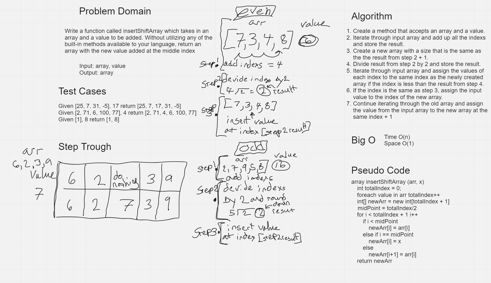

# Whiteboard Practice

[Back To Home](../../../../../../README.md)

### Whiteboard Process
Problem Description:

Write a function called insertShiftArray which takes in an array and a value to be added. Without utilizing any of the built-in methods available to your language, return an array with the new value added at the middle index.

### Approach & Efficiency

Create a function that takes an array and a value, adds up the indexs of the input array and divides them in half to get the array midpoint.  Create a new array and Loop through the input array assigning the value of its index to the same index of the new array only if the index is less than the middle point. If the index is equal to the midpoint assing the input value from the fuction to that index.
