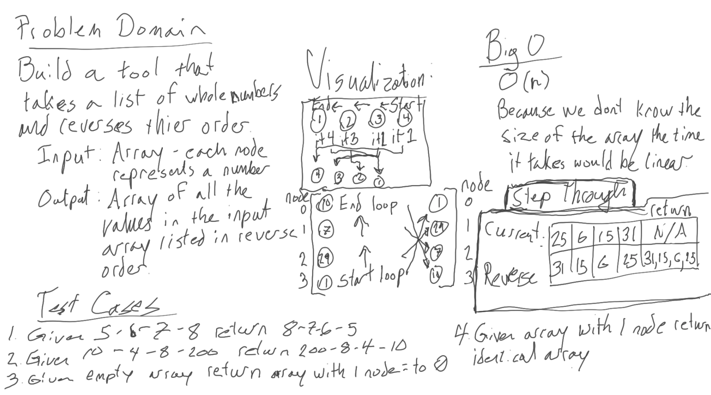
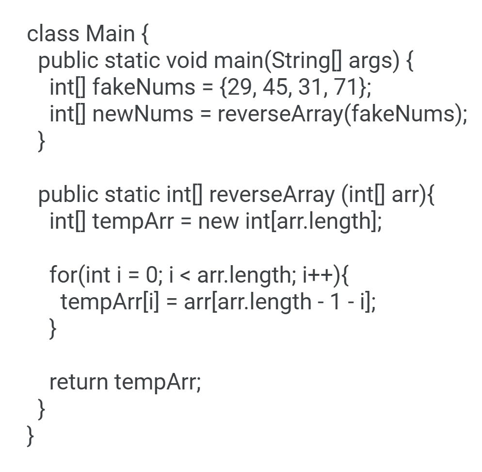

# Whiteboard Practice

[Back To Home](../../../../../../README.md)

### Whiteboard Process
Problem Description:

Write a function called reverseArray which takes an array as an argument. Without utilizing any of the built-in methods available to your language, return an array with elements in reversed order.

### Approach & Efficiency

Create an array of integers the size of the input array. Use a for loop that iterates through the input array and assigns the value at the index equal to the iteration step to the new array at the index equal to the input arrays length minus one minus the iteration step count.
