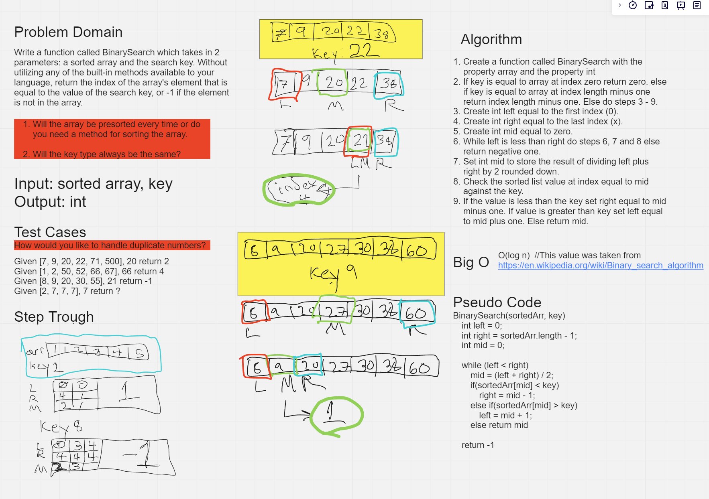

# Whiteboard Practice

[Back To Home](../../../../../../README.md)

### Whiteboard Process
Problem Description:

Write a function called BinarySearch which takes in 2 parameters: a sorted array and the search key. Without utilizing any of the built-in methods available to your language, return the index of the array’s element that is equal to the value of the search key, or -1 if the element is not in the array.

### Approach & Efficiency

Start off by creating two intergers named left and right and set lefts value to zero and rights value to the input array length minus one. Check the index at left for the key and the right for the key, if either has the key then return that index. If not then create an interger called mid.

While left is greater than right, set mid to left plus right divided by 2 rounded down. If array at index of mid is greater than the key then set right to mid minus one. If array at index of mid is less than the key set left to mid plus one else return mid and continue repeating this process. If left is ever greater than right return negative one.

