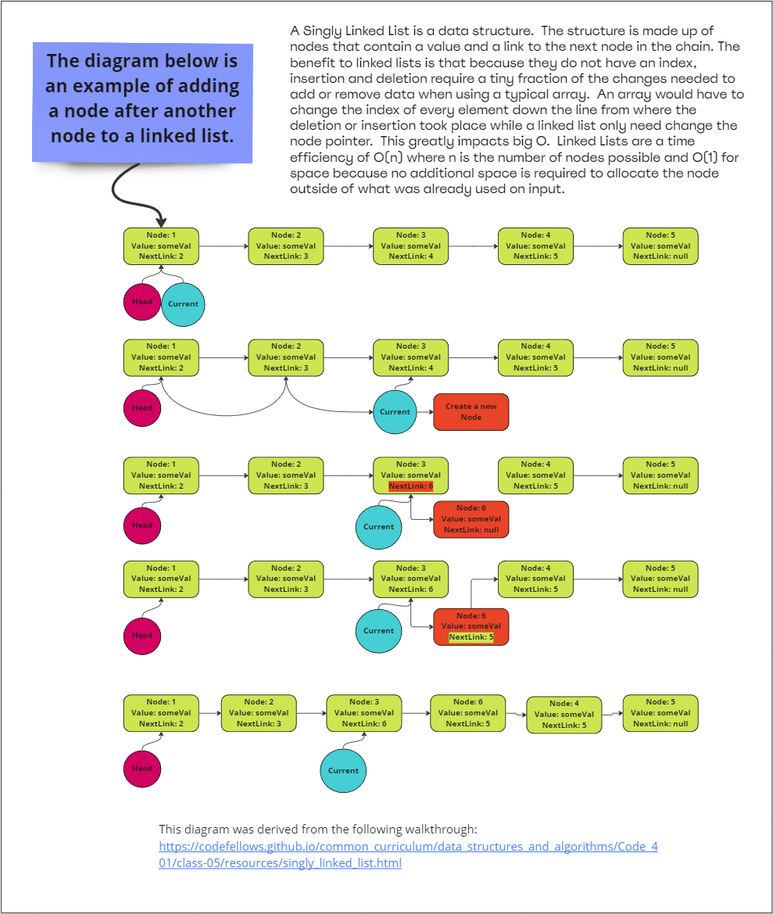

# Linked Lists

An implementation of a [linked list](https://www.educative.io/blog/data-structures-linked-list-java-tutorial) which is an ordered collection that contains many objects of the same type.

## Index

- [Back To Home](../../../../../../../../README.md)
- [Back To Data Structures](../../../../../../README.md)

## Whiteboard Example:

## Approach & Efficiency

The classic approach to a linked list was used for this project with the addition of a length attribute. The LinkedList is made up of a Head, Tail and Length and utilizes nodes to track data.

## Uses

- **.insert(int value)** *Return Type*: `void`
Insert adds a new node at the beginning of the list and assigns itself as the new head as well as assigning the input value to the nodes value.

- **.includes(int findValue)** *Return Type*: `Boolean`
Checks to see if value is contained within the list then returns true if the value was found and false if it is not.

- **.getLength()** *Return Type:*: `int`
Returns the length of the list.

- **.toString()** *Return Type*: `String`
Returns an ordered string of all the values in the list.

- **.append(int value)** *Return Type*: `void`
Adds a new node with the give value to the end of the list and assigns itself as the new tail.

- **.insertBefore(int value, int findValue)** *Return Type*: `void`
Adds a new node with the given new value immediately before the first node that has the value specified.

- **.insertAfter(int value, int findValue)** *Return Type*: `void`
Adds a new node with the given new value immediately after the first node that has the value specified

### Node Specifications

1. Create a Node class that has properties for the value stored in the Node, and a pointer to the next Node.

### Linked List Specifications

1. Create a Linked List class
   - Within your Linked List class, include a head property.
   - Upon instantiation, an empty Linked List should be created.
2. The class should contain the following methods
   - insert
     - Arguments: value
     - Returns: nothing
     - Adds a new node with that value to the head of the list with an O(1) Time performance.
   - includes
     - Arguments: value
     - Returns: Boolean
       - Indicates whether that value exists as a Node’s value somewhere within the list.
   - to string
     - Arguments: none
     - Returns: a string representing all the values in the Linked List, formatted as:
     - `"{ a } -> { b } -> { c } -> NULL"`
   - append
     - arguments: new value
     - adds a new node with the given value to the end of the list
   - insert before
     - arguments: value, new value
     - adds a new node with the given new value immediately before the first node that has the value specified
   - insert after
     - arguments: value, new value
     - adds a new node with the given new value immediately after the first node that has the value specified
